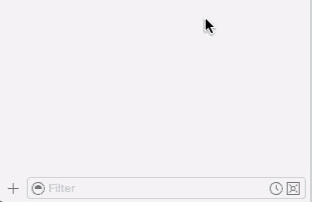
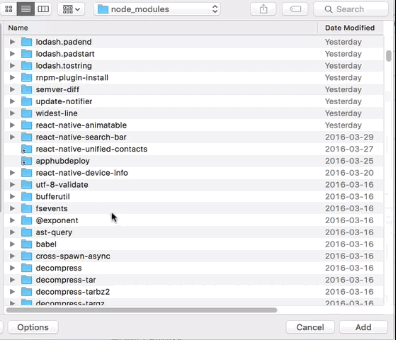

<!-- # React Native Unified Contacts -->
[](https://badge.fury.io/js/react-native-unified-contacts)

**Your best friend when working with the latest and greatest [Contacts Framework][apple-contacts-framework] in iOS 9+.**

### **Requires iOS 9+**

Apple recently did a complete overhaul of their Contacts Framework that does a number of things, including:

  1. Making it simpler to use the framework.

  2. Use the same framework across all their platforms, including iOS, tvOS, watchOS and even OS X.

  3. Get a unified Contact details not only from a User's local Contact entry, but also from the user's social accounts, like Facebook and Twitter. This allows you to get a Facebook profile picture for a Contact you have in your contact database.

There are a couple of react native packages that give you access to Contacts already ([react-native-contacts][react-native-contacts] and [react-native-addressbook][react-native-addressbook]) but neither of them utilize the new Unified Contacts framework available in iOS 9+. For good reason too, as most people are still supporting devices that are pre-iOS 9.

However, if you have the luxury of supporting iOS 9 and up, you should definitely use this library to  make use of this great new framework by Apple.


## Installation

  1. Install the npm package:
   ```bash
   npm install --save react-native-unified-contacts
   ```
   _This will install the latest react-native-unified-contacts package and add it to your package.json file._

  2. In Xcode, click the "Add Files to <your-project-name>":

  

  3. Navigate to `<your-project-directory>/node_modules/react-native-unified-contacts/` and click on the `RNUnifiedContacts` directory:

  


## Usage

### Require Library

```js
var Contacts  = require('react-native-unified-contacts');
```

### Methods

#### Get a Single Contact

```js
let contactIdentifier = 'A7806266-6574-4731-82E1-C54946F63E1C';

Contacts.getContact( contactIdentifier, (error, contact) =>  {
  if (error) {
    console.error(error);
  }
  else {
    console.log(contact);
  }
});
```

#### Delete a Single Contact

```js
let contactIdentifier = 'A7806266-6574-4731-82E1-C54946F63E1C';

Contacts.deleteContact( contactIndetifier, (error, success) => {
  if (error) {
    console.log(error);
  }
  else {
    console.log(success);
  }
}
```

#### Create a Single Contact

```js
let data = {
  'givenName': 'John',
  'familyName': 'Appleseed',
  'organizationName': 'Apple Inc',
  'phoneNumbers': [
    {'label': Contacts.phoneNumberLabel.HOME, 'number': '555-522-8243'},
    {'label': Contacts.phoneNumberLabel.WORK, 'number': '(408) 555-5270'},
  ],
  emailAddresses: [
    {'label': Contacts.emailAddressLabel.WORK, 'email': 'john.appleseed@apple.com'},
    {'label': Contacts.emailAddressLabel.HOME, 'email': 'john@gmail.com'},
  ],
}

Contacts.addContact( data, (error, success) {
  if (error) {
    console.log(error);
  } 
  else {
    console.log(success);
  }
}
```

#### Get All Contacts

```js
Contacts.getContacts( (error, contacts) =>  {
  if (error) {
    console.error(error);
  }
  else {
    console.log(contacts);
  }
});
```

#### Search All Contacts

```js
Contacts.searchContacts( 'Don Draper', (error, contacts) =>  {
  if (error) {
    console.error(error);
  }
  else {
    console.log(contacts);
  }
});
```
_This will search the given (first) and family (last) name of all of the Contacts for the provided string. Future versions will allow you to search other fields as well, like phone or email._

#### Can The User Access Contacts?

```js
Contacts.userCanAccessContacts( (userCanAccessContacts) => {
  if (userCanAccessContacts) {
    console.log("User has access to Contacts!");
  }
  else {
    console.log("User DOES NOT have access to Contacts!");
  }
});
```
_This will not **request** access. For that, use the [`requestAccessToContacts`](#request-access-to-contacts)._

#### Request Access To Contacts

```js
Contacts.requestAccessToContacts( (userCanAccessContacts) => {
  if (userCanAccessContacts) {
    console.log("User has access to Contacts!");
  }
  else {
    console.log("User DOES NOT have access to Contacts!");
  }
});
```
This will do everything you'd expect. Here's the workflow:

Does the user already have access to Contacts?

   1. Yes. Return `true`.

   2. No.

     1. If the User has not been asked before (first time asking), prompt user for access:

       1. Yes. Return `true`.

       2. No. Return `false`.

     2. If user has already denied access to Contacts, return `false`.

        _The user will have to go to their privacy settings and allow access manually. We provide a [`openPrivacySettings`](#open-privacy-settings) method that allows you to bring up the privacy page easily for the user. See below._


#### Open Privacy Settings

```js
Contacts.openPrivacySettings()
```

In the event that the User has denied access to their Contacts, you will need to have them manually change their setting in the privacy page. This method will open up the right page automatically for them and improves the experience for the user.

Here's an example of how you might alert the user that they need to update their privacy settings:

```js
// Alert the User that we can't access their Contact.
// Provide a link that will open up their Privacy Settings for ntwrk.
//
function alertUserToAllowAccessToContacts() {
  Alert.alert(
    "Can't Access Your Contacts",
    "Click on Open Settings and allow ntwrk to access your Contacts.\n" +
    "\n" +
    "Then come back!",
    [
      {text: 'Open Settings', onPress: () => Contacts.openPrivacySettings() },
      {text: "Later"}
    ]
  )
}
```

This will produce an alert similar to this:


### Contact Object

The returned Contact object(s) will look something like this:

```js
{
  familyName: "Draper",
  givenName:  "Donald",
  identifier: "A7806266-6574-4731-82E1-C54946F63E1C",
  imageDataAvailable: false,
  phoneNumbers: [
    {
      countryCode: "us",
      digits:      "4032694148",
      identifier:  "9CDE4C1B-412F-4974-BE8D-80C951004694",
      label:       "work",
      stringValue: "(403) 269-4147"  
    },
    {
      countryCode: "us",
      digits:      "4036071713",
      identifier:  "40477249-B50B-46A8-BF35-0A62B895A15A",
      label:       "mobile",
      stringValue: "(403) 607-1713"  
    }  
  ],
  emailAddresses: [
    {
      identifier: "9CDE4C1B-412F-4974-BE8D-80C951004694",
      label:      "work",
      value:      "don.draper@scdp.com"
    },
    {
      identifier: "9CDE4C1B-412F-4974-BE8D-80C951004694",
      label:      "home",
      value:      "theonedon@gmail.com"
    }
  ],
  postalAddresses: [
    {
      city:        "Menlo Park",
      country:     "United States",
      identifier:  "7481D15D-C27C-4805-876F-D2C0D413CEBD",
      label:       "work",
      postalCode:  "94025",
      state:       "CA",
      street:      "3000 Sand Hill Road, 3-290"
      stringValue: "3000 Sand Hill Road, 3-290.↵Menlo Park CA 94025↵"
    }
  ],
  birthday: [
    {
      day:   "15",
      month: "4",
      year:  "1985"
    }
  ],
  note: "What you call love was invented by guys like me … to sell nylons."
}
```

_NOTE: The birthday key will not be included if the Contact's birthday is not set. Also, it's possible for a Contact's
  birthday to not include the `year`. In this case, `year` will be `null`._

#### Thumbnail Image

Thumbnail Image Data is stored in a base64 format and can easily be used with the `Image` component of React Native as follows:

```js
// contact is a single Contact record retrieved from something like Contacts.getContacts().
var base64ImageUri = 'data:image/png;base64,' + contact.thumbnailImageData;

<Image source={{uri: base64ImageUri}}/>
```


## Many Thanks To

* My friend **[Smixx][smixx]** for working through adding a Swift library to a React Native project over his lunch hour.
* **[Ismail Pelaseyed][homanp]** for adding a couple of [huge PRs][homanp-prs] for Creating, Updating and Deleting Contacts.

## TODO

- [X] Add Create/Update/Delete methods for Contacts. **_(Thanks [homanp][homanp]!)_**
- [ ] Add Android support.
- [ ] Add integration with Contacts-UI (_Coming Soon!_).


## License

The MIT License (MIT)

Copyright 2016 - `Time.now()` by [Joshua Pinter][joshuapinter]


[apple-contacts-framework]: https://developer.apple.com/library/ios/documentation/Contacts/Reference/Contacts_Framework/index.html
[react-native-contacts]:    https://github.com/rt2zz/react-native-contacts
[react-native-addressbook]: https://github.com/rt2zz/react-native-addressbook
[smixx]:                    https://twitter.com/smixx
[joshuapinter]:             https://twitter.com/joshuapinter
[homanp]:                   https://twitter.com/pelaseyed
[homanp-prs]:               https://github.com/joshuapinter/react-native-unified-contacts/pulls?utf8=%E2%9C%93&q=is%3Apr+author%3Ahomanp+
