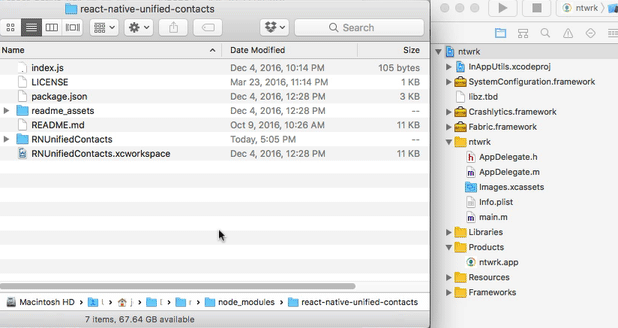
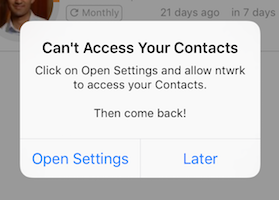

<!-- # React Native Unified Contacts -->
[](https://badge.fury.io/js/react-native-unified-contacts)

**Your best friend when working with the latest and greatest [Contacts Framework][apple-contacts-framework] in iOS 9+.**

### **Requires iOS 9+ and Swift 3.1**

Apple recently did a complete overhaul of their Contacts Framework that does a number of things, including:

  1. Making it simpler to use the framework.

  2. Use the same framework across all their platforms, including iOS, tvOS, watchOS and even OS X.

  3. Get unified Contact details not only from a User's local Contact entry, but also from the user's social accounts, like Facebook and Twitter. This allows you to get a Facebook profile picture for a Contact you have in your contact database.

There are a couple of react native packages that give you access to Contacts already ([react-native-contacts][react-native-contacts] and [react-native-addressbook][react-native-addressbook]) but neither of them utilize the new Unified Contacts framework available in iOS 9+. For good reason too, as most people are still supporting devices that are pre-iOS 9.

However, if you have the luxury of supporting iOS 9 and up, you should definitely use this library to  make use of this great new framework by Apple.


# Installation

  1. Install the npm package:
   ```bash
   npm install --save react-native-unified-contacts
   ```
   _This will install the latest react-native-unified-contacts package and add it to your package.json file._

  2. Navigate to `<your-project-directory>/node_modules/react-native-unified-contacts/` and drag the `RNUnifiedContacts` directory into your project directory in Xcode.

    Ensure that `Copy items if needed` is **not** checked, select `Create groups` and ensure your project is selected for a target.

    

  3. For iOS 10+, you need to add a `NSContactsUsageDescription` key to your `Info.plist` that provides a reason why your app needs to access private information:

  ```
<key>NSContactsUsageDescription</key>
<string>ntwrk accesses Contacts in order to quickly add Relationships and allow them to reach out via ntwrk through email, text, phone, etc.</string>
```

  If done through XCode UI, the key is named `Privacy - Contacts Usage Description`.

  4. See the [Usage section](#usage) for how to require the library and make use of it.


## Usage

  If done through XCode UI, the key is named `Privacy - Contacts Usage Description`.

# Usage

## Require Library

```js
var Contacts  = require('react-native-unified-contacts');
```

## Getting Contacts

### Get a single contact

```js
let contactIdentifier = 'A7806266-6574-4731-82E1-C54946F63E1C';

Contacts.getContact( contactIdentifier, (error, contact) =>  {
  if (error) {
    console.error(error);
  }
  else {
    console.log(contact);
  }
});
```

### Get All Contacts

```js
Contacts.getContacts( (error, contacts) =>  {
  if (error) {
    console.error(error);
  }
  else {
    console.log(contacts);
  }
});
```

### Search All Contacts

```js
Contacts.searchContacts( 'Don Draper', (error, contacts) =>  {
  if (error) {
    console.error(error);
  }
  else {
    console.log(contacts);
  }
});
```
_This will search the given (first), family (last) and nick names of all of the contacts for the provided string. Future versions will allow you to search other fields as well, like phone or email._

## Adding Contacts

### Add a single contact

```js
let contactData = {
  'givenName':        'John',
  'familyName':       'Appleseed',
  'organizationName': 'Apple Inc',
  'phoneNumbers': [
    {'label': Contacts.phoneNumberLabel.HOME, 'stringValue': '555-522-8243'},
    {'label': Contacts.phoneNumberLabel.WORK, 'stringValue': '(408) 555-5270'},
  ],
  'emailAddresses': [
    {'label': Contacts.emailAddressLabel.WORK, 'value': 'john.appleseed@apple.com'},
    {'label': Contacts.emailAddressLabel.HOME, 'value': 'john@gmail.com'},
  ],
}

Contacts.addContact( contactData, (error, success) => {
  if (error) {
    console.log(error);
  }
  else {
    console.log(success);
  }
});
```

## Updating Contacts

### Update a single contact

```js
let contactIdentifier = 'A7806266-6574-4731-82E1-C54946F63E1C';

let contactData = {
  'givenName':        'John',
  'familyName':       'Appleseed',
  'organizationName': 'Apple Inc',
  'phoneNumbers': [
    {'label': Contacts.phoneNumberLabel.HOME, 'stringValue': '555-522-8243'},
    {'label': Contacts.phoneNumberLabel.WORK, 'stringValue': '(408) 555-5270'},
  ],
  'emailAddresses': [
    {'label': Contacts.emailAddressLabel.WORK, 'value': 'john.appleseed@apple.com'},
    {'label': Contacts.emailAddressLabel.HOME, 'value': 'john@gmail.com'},
  ],
}

Contacts.updateContact(contactIdentifier, contactData, (error, success) => {
  if (error) {
    console.log(error);
  }
  else {
    console.log(success);
  }
});
```

_NOTE: If your `contactData` includes the keys `phoneNumbers` or `emailAddresses`, the associated value will completely replace any Phone Numbers or Email Addresses for that Contact, respectively. In other words, if you have a contact with two Phone Numbers and you'd like to add a third, you need to pass in ALL THREE Phone Numbers, not just the new one. Same goes for Email Addresses._


## Deleting Contacts

### Delete a single contact

```js
let contactIdentifier = 'A7806266-6574-4731-82E1-C54946F63E1C';

Contacts.deleteContact( contactIdentifier, (error, success) => {
  if (error) {
    console.log(error);
  }
  else {
    console.log(success);
  }
}
```

## Getting Groups

### Get a single group

```js
let groupIdentifier = 'A7806266-6574-4731-82E1-C54946F63E1C';

Contacts.getGroup( groupIdentifier, (error, group) =>  {
  if (error) {
    console.error(error);
  } else {
    console.log(group);
  }
});
```

### Get all Groups

```js
Contacts.getGroups( (error, groups) =>  {
  if (error) {
    console.error(error);
  }
  else {
    console.log(groups);
  }
});
```

### Get contacts in group

```js
let groupIdentifier = 'A7806266-6574-4731-82E1-C54946F63E1C';

Contacts.contactsInGroup(groupIdentifier, (error, contacts) =>  {
  if (error) {
    console.error(error);
  } else {
    console.log(contacts);
  }
});
```

## Add a group

```js
let groupData = {
  'name': 'Friends'
}

Contacts.addGroup(groupData, (error, success) => {
  if (error) {
    console.log(error);
  }
  else {
    console.log(success);
  }
});
```

## Update a group

```js
let groupIdentifier = 'A7806266-6574-4731-82E1-C54946F63E1C';

let groupData = {
  'name': 'Friends'
}

Contacts.updateGroup(groupIdentifier, groupData, (error, success) => {
  if (error) {
    console.log(error);
  }
  else {
    console.log(success);
  }
});
```

## Delete a group

```js
let groupIdentifier = 'A7806266-6574-4731-82E1-C54946F63E1C';

Contacts.deleteGroup(groupIdentifier, (error, success) => {
  if (error) {
    console.log(error);
  }
  else {
    console.log(success);
  }
});
```

## Add contacts to a group

```js
let groupIdentifier = 'A7806266-6574-4731-82E1-C54946F63E1C';

let contactIdentifiers = [
  '4E5R6TGH-2EWQ-SAD2-SADS-2344EWFSDCSA',
  '8GFK43JK-2E3F-U6HF-UYTB-23R4TGTHYRDF',
  '5FTGYUHG-DSFD-4T5H-43TR-0IOJUVBHJNVG'
]

Contacts.addContactsToGroup(groupIdentifier, contactIdentifiers, (error, success) => {
  if (error) {
    console.log(error);
  } else {
    console.log(success);
  }
});
```

## Remove contacts from a group

```js
let groupIdentifier = 'A7806266-6574-4731-82E1-C54946F63E1C';

let contactIdentifiers = [
  '4E5R6TGH-2EWQ-SAD2-SADS-2344EWFSDCSA',
  '8GFK43JK-2E3F-U6HF-UYTB-23R4TGTHYRDF',
  '5FTGYUHG-DSFD-4T5H-43TR-0IOJUVBHJNVG'
]

Contacts.removeContactsFromGroup(groupIdentifier, contactIdentifiers, (error, success) => {
  if (error) {
    console.log(error);
  } else {
    console.log(success);
  }
});
```

## Accessing the User's Contacts

### Can The User Access Contacts?

```js
Contacts.userCanAccessContacts( (userCanAccessContacts) => {
  if (userCanAccessContacts) {
    console.log("User has access to Contacts!");
  }
  else {
    console.log("User DOES NOT have access to Contacts!");
  }
});
```
_This will not **request** access. For that, use the [`requestAccessToContacts`](#request-access-to-contacts)._


### Request Access To Contacts

```js
Contacts.requestAccessToContacts( (userCanAccessContacts) => {
  if (userCanAccessContacts) {
    console.log("User has access to Contacts!");
  }
  else {
    console.log("User DOES NOT have access to Contacts!");
  }
});
```
This will do everything you'd expect. Here's the workflow:

1. Does the user already have access to Contacts?

   1. Yes. Return `true`.

   2. No.

     1. If the User has not been asked before (first time asking), prompt user for access:

        1. Yes. Return `true`.

        2. No. Return `false`.

     2. If user has already denied access to Contacts, return `false`.

        _The user will have to go to their privacy settings and allow access manually. We provide a [`openPrivacySettings`](#open-privacy-settings) method that allows you to bring up the privacy page easily for the user. See below._


### Open the User's Privacy Settings

```js
Contacts.openPrivacySettings()
```

In the event that the User has denied access to their Contacts, you will need to have them manually change their setting in the privacy page. This method will open up the right page automatically for them and improves the experience for the user.

Here's an example of how you might alert the user that they need to update their privacy settings:

```js
// Alert the User that we can't access their Contact.
// Provide a link that will open up their Privacy Settings for ntwrk.
//
function alertUserToAllowAccessToContacts() {
  Alert.alert(
    "Can't Access Your Contacts",
    "Click on Open Settings and allow ntwrk to access your Contacts.\n" +
    "\n" +
    "Then come back!",
    [
      {text: 'Open Settings', onPress: () => Contacts.openPrivacySettings() },
      {text: "Later"}
    ]
  )
}
```

This will produce an alert similar to this:




## Contact Object

The returned Contact object(s) will look something like this:

```js
{
  "contactRelations": [
    {
      "label": "Mother",
      "identifier": "2D103009-45E2-4CA5-A2D5-50642EE7430C",
      "name": "Mother Name",
      "localizedLabel": "mother"
    }
  ],
  "middleName": "Middle Name",
  "phoneticGivenName": "Phonetic Given Name",
  "phoneticMiddleName": "Phonetic Middle Name",
  "nickname": "Nickname",
  "phoneticFamilyName": "Phonetic Family Name",
  "previousFamilyName": "Previous Family Name",
  "familyName": "Family Name",
  "phoneNumbers": [
    {
      "label": "Home",
      "identifier": "73A0E4B6-86F6-4FAF-A7C3-D55705CA1DFF",
      "stringValue": "1 (234) 567-8901",
      "countryCode": "us",
      "digits": "12345678901",
      "localizedLabel": "home"
    }
  ],
  "identifier": "D296E8E2-982F-4C39-9845-B75808B9CF96:ABPerson",
  "givenName": "Given Name",
  "dates": [
    {
      "label": "Anniversary",
      "identifier": "FB73491F-E505-4864-8B68-F5F17C5AC4D7",
      "year": 2016,
      "month": 1,
      "day": 30,
      "localizedLabel": "anniversary"
    }
  ],
  "fullName": "Full Name",
  "nonGregorianBirthday": {
    "year": 33,
    "month": 1,
    "day": 3
  },
  "departmentName": "Department Name",
  "socialProfiles": [
    {
      "label": "twitter",
      "localizedLabel": "twitter",
      "service": "Twitter",
      "localizedService": "Twitter",
      "urlString": "http://twitter.com/12345",
      "userIdentifier": "",
      "username": "12345",
      "identifier": "53698CFA-0125-48FE-84D7-E8372CD99ECD"
    }
  ],
  "emailAddresses": [
    {
      "label": "Home",
      "identifier": "8AE516A9-A531-4BBA-B890-BFA59E47A4C7",
      "value": "person@example.com",
      "localizedLabel": "home"
    }
  ],
  "instantMessageAddresses": [
    {
      "label": "Skype",
      "identifier": "82200A8E-4F19-4F5A-A7AF-FA9F8C43B01A",
      "service": "Skype",
      "localizedService": "Skype",
      "username": "12345",
      "localizedLabel": "Skype"
    }
  ],
  "note": "Note",
  "postalAddresses": [
    {
      "label": "Home",
      "city": "City",
      "state": "CA",
      "localizedLabel": "home",
      "postalCode": "98765",
      "country": "United States",
      "isoCountryCode": "",
      "stringValue": "123 St\nCity CA 98765\nUnited States",
      "street": "123 St",
      "identifier": "7A472311-AB4F-46F4-B046-B60143DBC858"
    }
  ],
  "urlAddresses": [
    {
      "label": "HomePage",
      "identifier": "13F46F96-E5EE-4B6F-A8A6-EBC3C459E314",
      "value": "www.example.com",
      "localizedLabel": "homepage"
    }
  ],
  "organizationName": "Organization Name",
  "birthday": {
    "month": 1,
    "day": 30
  },
  "nameSuffix": "Name Suffix",
  "imageDataAvailable": false,
  "contactType": "person",
  "namePrefix": "Name Prefix",
  "jobTitle": "Job Title"
}
```

_NOTE: The birthday key will not be included if the Contact's birthday is not set. Also, it's possible for a Contact's
  birthday to not include the `year`. In this case, `year` will be `null`._

### Thumbnail Image

Thumbnail Image Data is stored in a base64 format and can easily be used with the `Image` component of React Native as follows:

```js
// contact is a single Contact record retrieved from something like Contacts.getContacts().
var base64ImageUri = 'data:image/png;base64,' + contact.thumbnailImageData;

<Image source={{uri: base64ImageUri}}/>
```

# Troubleshooting

If you run into trouble, take a look at the following thread:

https://github.com/joshuapinter/react-native-unified-contacts/issues/15

You should also have the latest version of XCode (8.2+) and Swift (3+).

If that doesn't help you, please [create an Issue](https://github.com/joshuapinter/react-native-unified-contacts/issues/new) and we'll figure it out together.

# Many Thanks To

* My friend **[Smixx][smixx]** for working through adding a Swift library to a React Native project over his lunch hour.
* **[Ismail Pelaseyed (homanp)][homanp]** for adding a couple of [huge PRs][homanp-prs] for Creating, Updating and Deleting Contacts.
* **[Chris Edwards (chrise86)][chrise86]** for adding a tonne of [big PRs][chrise86-prs] for Adding, Updating and Deleting Groups.

# TODO

- [X] Add Create/Update/Delete methods for Contacts. **_(Thanks [homanp][homanp]!)_**
- [ ] Add Android support.
- [ ] Add integration with Contacts-UI (_Coming Soon!_).


# License

The MIT License (MIT)

Copyright 2016 - `Time.now()` by [Joshua Pinter][joshuapinter]


[apple-contacts-framework]: https://developer.apple.com/library/ios/documentation/Contacts/Reference/Contacts_Framework/index.html
[react-native-contacts]:    https://github.com/rt2zz/react-native-contacts
[react-native-addressbook]: https://github.com/rt2zz/react-native-addressbook
[smixx]:                    https://twitter.com/smixx
[joshuapinter]:             https://twitter.com/joshuapinter
[homanp]:                   https://twitter.com/pelaseyed
[homanp-prs]:               https://github.com/joshuapinter/react-native-unified-contacts/pulls?utf8=%E2%9C%93&q=is%3Apr+author%3Ahomanp+
[chrise86]:                 https://github.com/chrise86
[chrise86-prs]:             https://github.com/joshuapinter/react-native-unified-contacts/pulls?utf8=%E2%9C%93&q=is%3Apr%20author%3Achrise86
